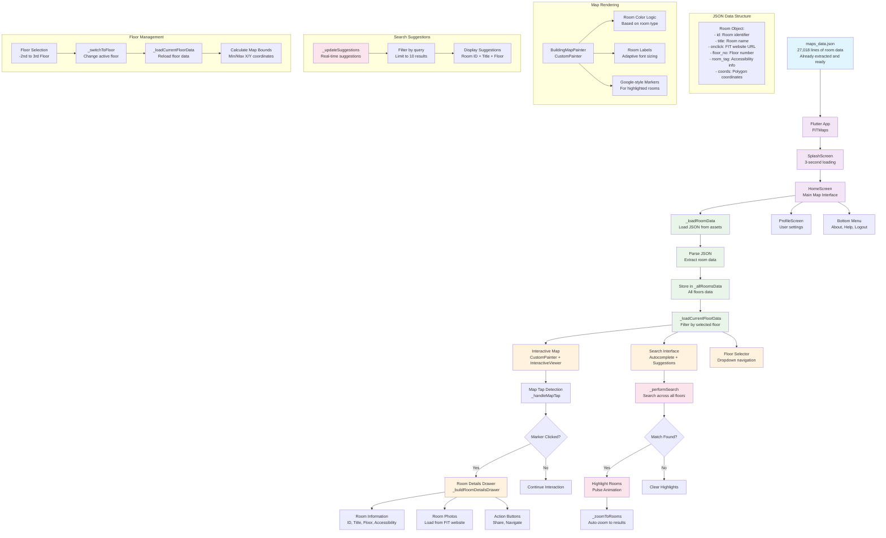

# FITMaps System Flow Analysis

## System Architecture Overview

The FITMaps application is a Flutter-based navigation system for the FIT faculty building. Here's the complete system flow:

## Key System Components

### 1. Data Pipeline
- **Source**: Pre-extracted JSON data (`maps_data.json`) in `parsed_data` folder
- **Content**: Structured JSON with 27,018 lines of room information
- **Format**: Each room contains ID, title, coordinates, floor number, and accessibility info
- **Ready-to-use**: No processing needed - directly loaded by Flutter app

### 2. Flutter App Architecture
- **Main App**: MaterialApp with custom theme
- **Splash Screen**: 3-second loading with FIT logo
- **Home Screen**: Primary interface with interactive map
- **Profile Screen**: User settings and navigation

### 3. Map Implementation
- **Custom Painter**: `BuildingMapPainter` renders rooms as polygons
- **Interactive Viewer**: Zoom, pan, and tap interactions
- **Room Colors**: Dynamic coloring based on room type (office, lab, staircase, etc.)
- **Adaptive Labels**: Font size adjusts based on room area and zoom level

### 4. Search System
- **Real-time Search**: Searches across all floors simultaneously
- **Autocomplete**: Shows up to 10 suggestions as user types
- **Smart Navigation**: Automatically switches floors if room found elsewhere
- **Visual Feedback**: Highlights matching rooms with pulse animation

### 5. Room Interaction
- **Tap Detection**: Calculates distance to room markers for click detection
- **Details Drawer**: Slides up from bottom with room information
- **Photo Loading**: Attempts to load photos from FIT website
- **Action Buttons**: Share functionality and external links

### 6. Floor Management
- **Multi-floor Support**: -2nd to 3rd floor navigation
- **Dynamic Loading**: Loads only current floor data for performance
- **Bound Calculation**: Automatically calculates map bounds for each floor
- **Smooth Transitions**: Animated floor switching

## Data Flow Summary

1. **Initialization**: App loads pre-extracted JSON data from `data/parsed_data/maps_data.json` into memory
2. **Floor Selection**: User selects floor, app filters and loads floor-specific data from the loaded JSON
3. **Map Rendering**: Custom painter draws rooms with appropriate colors and labels using coordinate data
4. **Search Interaction**: User types query, system searches all floors and highlights matches
5. **Room Selection**: User taps room marker, drawer opens with detailed information
6. **Navigation**: User can switch floors, search again, or access profile

The system efficiently handles large datasets (27K+ rooms) using pre-processed JSON data while providing smooth, interactive navigation with real-time search capabilities.
